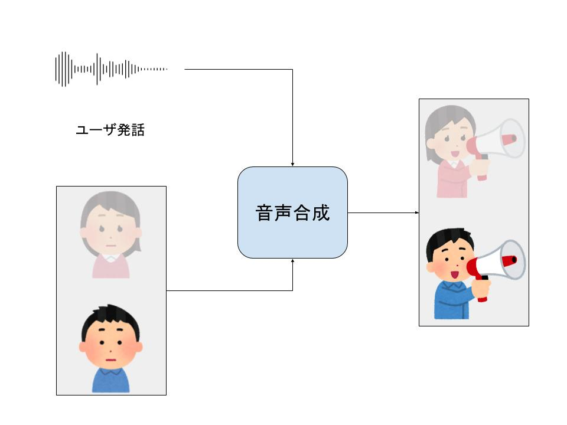

# DNN_voice_change

# 概要
「キャラクターの外見」に合った声に変換したい
- キャラクター相貌から予想される声への多対多声質変換システム

イメージ図

# 実現方法
VocoderとVAE使ってencoderに音響特徴量いれて、decoderにキャラクター画像特徴量入れて学習させたら、画像を変化させると音声が変化する声質変換システムができるはず

"""イメージ図はおいおい作る"""
